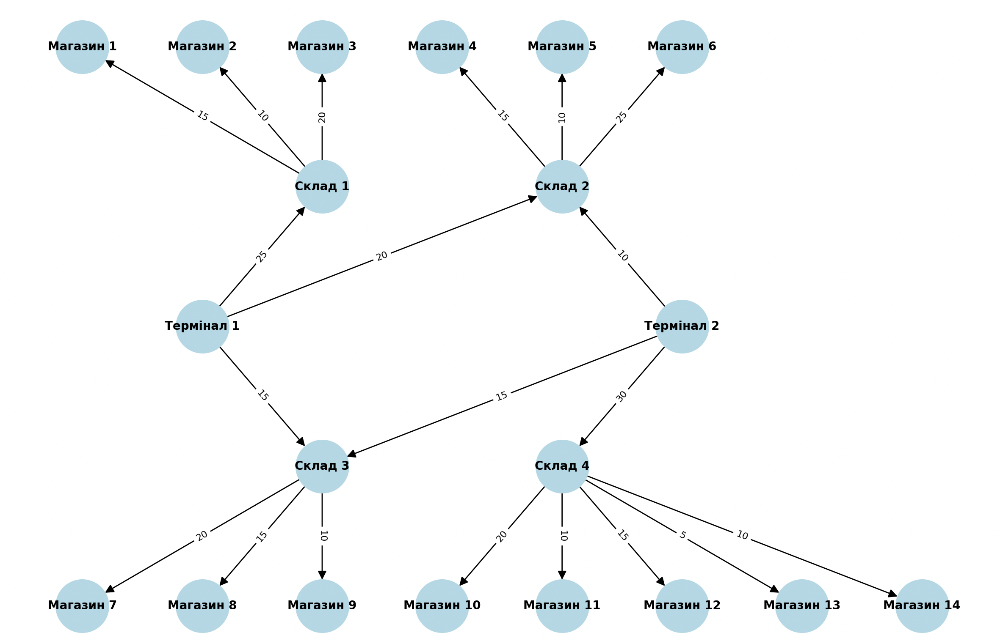

1. Які термінали забезпечують найбільший потік товарів до магазинів?

      Обидва термінали постачають 130 одиниць продукції, але перший постачає в 9 магазинів, а другий - в 11

2. Які маршрути мають найменшу пропускну здатність і як це впливає на загальний потік?

   Якщо не враховувати маршрути з 0, то найменший - терминал2-магазин 13

3. Які магазини отримали найменше товарів і чи можна збільшити їх постачання, збільшивши пропускну здатність певних маршрутів?

  2, 11, 13, 14 - вони отримують постачання 3 одного термінала

4. Чи є вузькі місця, які можна усунути для покращення ефективності логістичної мережі?

  Кожний склад має отримувати товар з двох терминалів,  збільшити канал термінал2-склад2

Task2:

Total range_query time for OOBTree: 0.002724 seconds

Total range_query time for Dict: 1.384531 seconds
